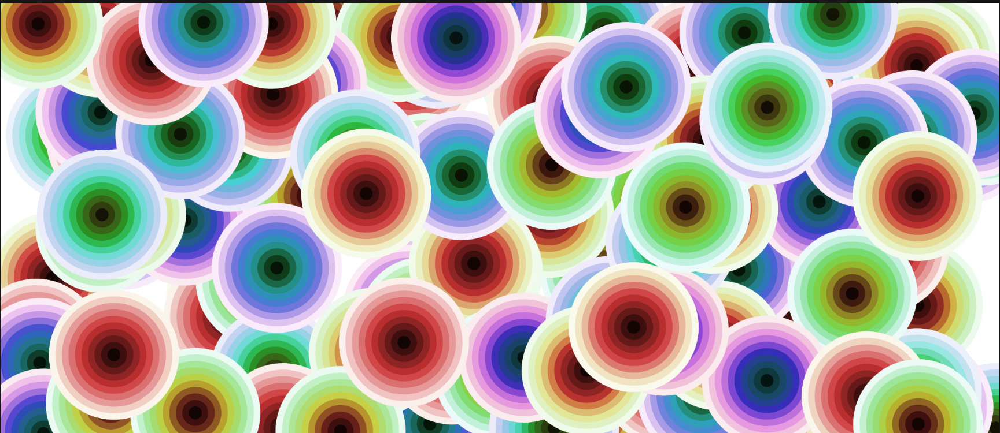

# Color Blooms (WIP)


## What is Color Blooms?
Color Blooms is an interactive creative coding project written with p5.js.
The user can play with the provided parameters to create a blooming field of colors with
varying shapes and other visual properties.

**Color Blooms is WIP as of 28/09/2021**. The website displays only a static rendering
of the sketching algorithm currently.

## What does this repository contain?
This repository contains the source code for the project. The project is hosted
on [GitHub pages](https://ejgenc.github.io/color-blooms/) for now, but in the future will move to a dedicated website.

## Project  Organization
--------
```
    |
    ├── css
    |   ├── grid.css        <- The CSS file where the grid and the general responsive behavior of the grid is defined.
    |   ├── main.css        <- The CSS file where the UI variables and general styling is defined.
    |   ├── normalize.css   <- Written by Nicolas Gallagher. CSS normalization across browsers.
    |
    ├── media
    |   ├── images          <- Banner images and static example output of the project.
    |
    ├── src                 <- JavaScript source code for the project.
    |   ├── main.js         <- General JS functionality.
    |   ├── sketc.js        <- p5.js specific code.
    |
    ├── index.html          <- The HTML5 file that represents the project.
    |
    |── .gitignore          <- A file to specify which folders/files will be flagged with  gitignore
    |
    ├── LICENSE             < - Software license.
    |
    ├── README.md           <- The top-level README for the users of this project.
    |
```
--------